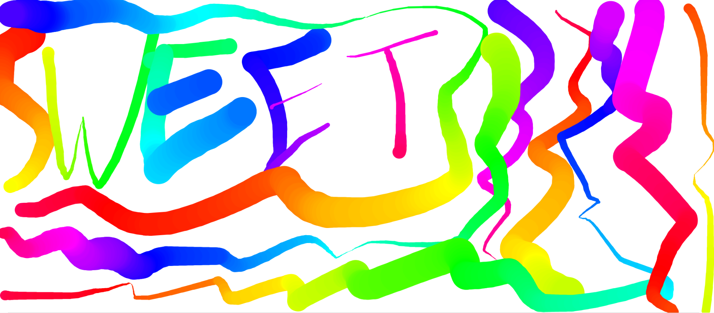

# JS-HTML-Canvas

<!-- Live link to deployed app -->

Repository: https://github.com/Mdudzik92/JS-HTML-Canvas  
Deployed app: https://mdudzik92.github.io/JS-HTML-Canvas/

<!-- Technologies used -->

HTML, JavaScript, Canvas

<!-- Explanation of what the app is -->

This is an app in which the user can draw beautiful images on an HTML Canvas powered by JavaScript. All the user needs to do is hold the mouse down anywhere on the page to start a line, drag the mouse in any direction they'd like, then let go of the mouse to end te line. The line changes hue and width size as it is held. Click the link to the deployed app or download the repo to give it a try!

<!-- Screenshot -->

<!-- License -->

MIT

<!-- Contact information -->

Email: mdudzik92@gmail.com
